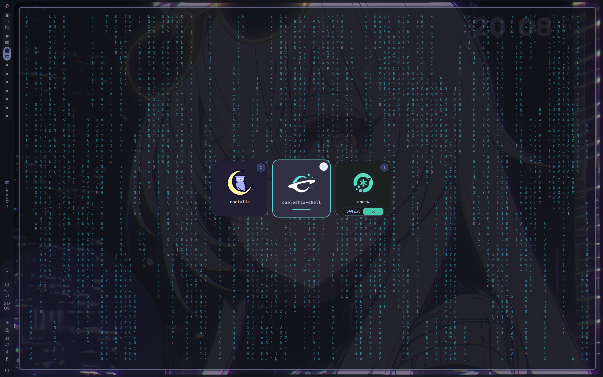
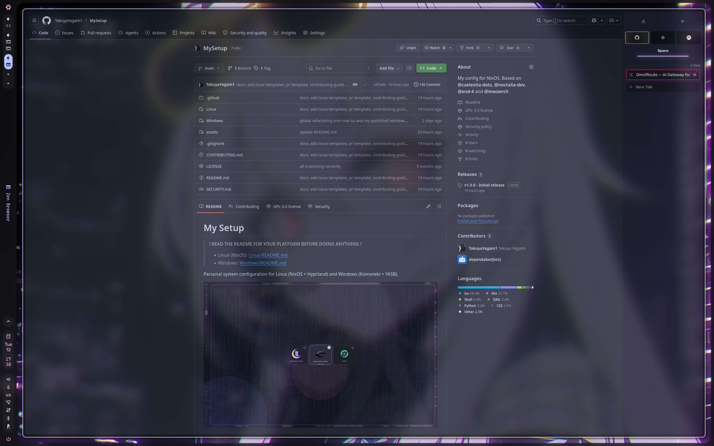
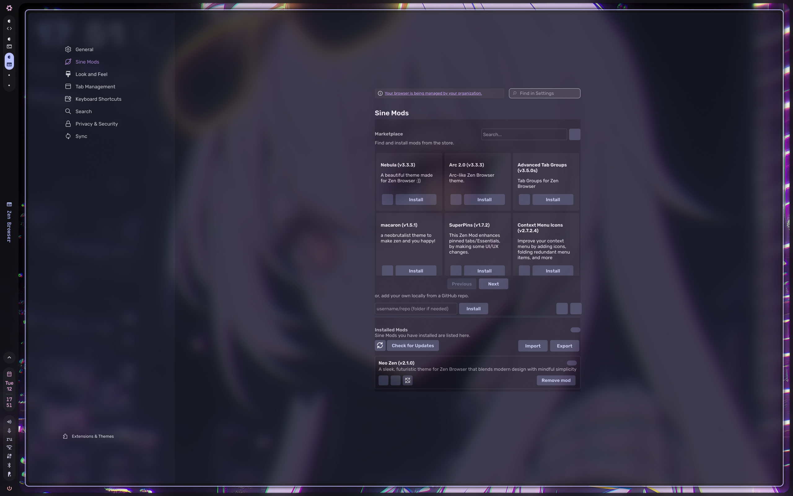
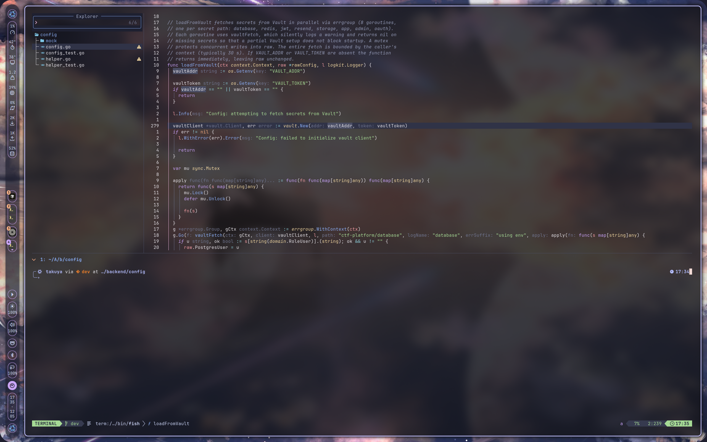
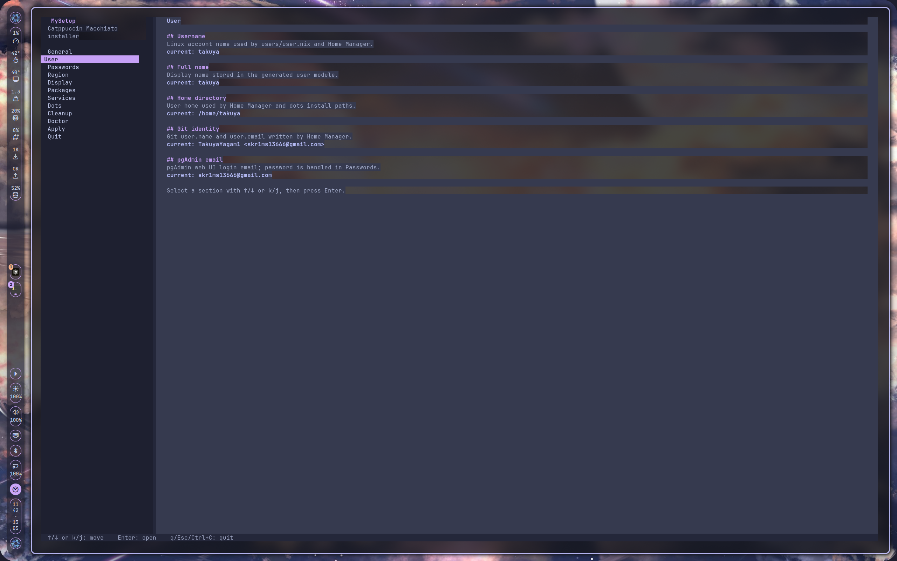
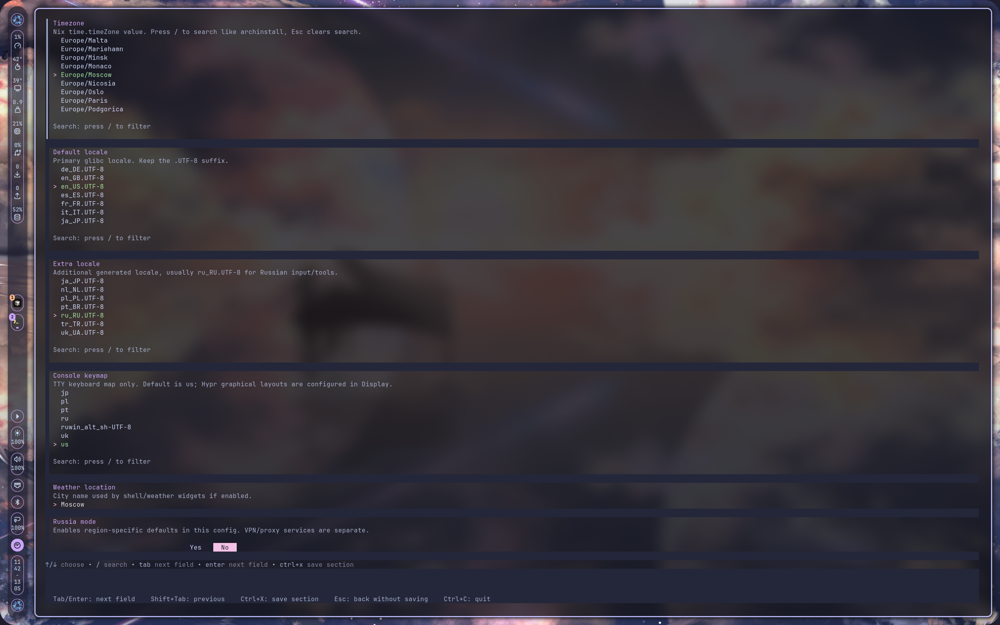
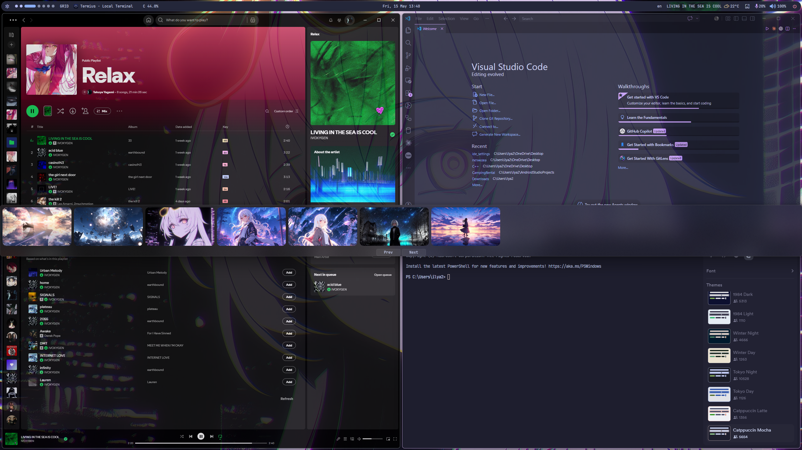

# My Setup

> **! READ THE README FOR YOUR PLATFORM BEFORE DOING ANYTHING !**
>
> - Linux (NixOS): [Linux/README.md](Linux/README.md)
> - Windows: [Windows/README.md](Windows/README.md)

Personal system configuration for Linux (NixOS + Hyprland) and Windows (Komorebi + YASB).
The Linux Hyprland runtime targets Hyprland 0.55+ and uses Lua config
entrypoints (`hyprland.lua` plus Lua modules) instead of legacy hyprlang
`hyprland.conf` fragments.

[](https://youtu.be/fgmueUOnfhk)

*[8-minute video tour of the NixOS side](https://youtu.be/fgmueUOnfhk) - click the image above*

## Screenshots

| Zen Browser (Catppuccin chrome) | Zen + Sine mods | Neovim (LazyVim) |
| :---: | :---: | :---: |
|  |  |  |

> Zen Browser theming lives in [`Linux/dots/zen/chrome/`](Linux/dots/zen/chrome).
> Neovim config (LazyVim-based) lives in [`Linux/dots/nvim/`](Linux/dots/nvim).

### TUI Installer

| User section | Display / Region section |
| :---: | :---: |
|  |  |

### Windows (Komorebi + YASB)



> Contributors: read [CONTRIBUTING.md](CONTRIBUTING.md) before opening a PR. Security issues: see [SECURITY.md](SECURITY.md).

## Structure

- **Linux/** - NixOS configuration with Hyprland 0.55+ Lua config, custom themes, dev environment
- **Windows/** - Windows configuration with Komorebi tiling WM and YASB status bar

## Quick Start

### Linux (NixOS)

> **Read [Linux/README.md](Linux/README.md) first** - contains pre-installation requirements,
> path configuration, regional notes, and troubleshooting.

No-clone install or reconfigure (recommended - Nix fetches the installer into
`/nix/store`; the installed `/etc/nixos` stays thin and tracks the reusable
MySetup NixOS flake). Use `--refresh` when you want the latest pushed commit
instead of Nix's cached GitHub source:

```bash
nix run --refresh 'github:TakuyaYagam1/MySetup'
```

Or with a local clone (useful when iterating on the config):

```bash
git clone https://github.com/TakuyaYagam1/MySetup.git
cd MySetup
nix run "path:$PWD"
```

The direct NixOS installer app is equivalent and exposes the CLI subcommands
explicitly:

```bash
# Apply the default thin /etc/nixos layout.
nix run --refresh 'github:TakuyaYagam1/MySetup?dir=Linux/NixOS#mysetup' -- apply

# Validate the staged system build without writing /etc/nixos or switching.
nix run --refresh 'github:TakuyaYagam1/MySetup?dir=Linux/NixOS#mysetup' -- apply --no-switch

# Keep the legacy full mirror layout while migrating or debugging.
nix run --refresh 'github:TakuyaYagam1/MySetup?dir=Linux/NixOS#mysetup' -- apply --layout full

# Inspect or repair an installed host.
nix run --refresh 'github:TakuyaYagam1/MySetup?dir=Linux/NixOS#mysetup' -- doctor
```

After install, normal updates happen from `/etc/nixos`:

```bash
nixos-update
```

That command runs `nix flake update` in `/etc/nixos` and then switches the
system, so the `mysetup` input receives CI-tested package/service changes
without copying the full repository into `/etc/nixos`.

Useful post-apply checks:

```bash
systemctl cat omnirouter.service | rg 'ExecStartPre|omnirouter-ensure-server-env'
sudo systemctl status omnirouter.service
```

The repository root flake also exposes reusable shell modules and the full host
constructor for external NixOS flakes. Pin a release tag for immutable installs,
or use a moving branch such as `stable` for latest-release updates via
`nix flake update`:

```nix
inputs.mysetup = {
  url = "github:TakuyaYagam1/MySetup/stable";
  inputs.nixpkgs.follows = "nixpkgs";
};
```

Then import the shell module in your NixOS host:

```nix
modules = [
  inputs.mysetup.nixosModules.shells

  {
    system.stateVersion = "26.05";
    mysetup.user = {
      username = "alice";
      fullName = "Alice";
      homeDirectory = "/home/alice";
    };
  }
];
```

For a full MySetup host wrapper, use `mysetup.lib.mkMySetupHost` from the
`Linux/NixOS` flake or the root re-export. The installer generates this shape
automatically in `/etc/nixos/flake.nix`; it is the supported public API for the
complete workstation stack.

The installer will ask you about:

- Username and password
- Package preset (personal / developer / desktop / minimal)
- Display and keyboard layout
- Secure Boot (Lanzaboote)
- GPU type (AMD / Intel / NVIDIA)
- Region (Russia - disables DataGrip, enables Zapret by default)
- Zapret DPI bypass config
- CTF tools
- User dotfiles (Hypr, Zen Browser theme, Neovim, wallpapers)

Shell profile is no longer an install-time question. After the system is
applied, switch between `caelestia-shell`, `noctalia-shell`, and `end-4`
(Illogical Impulse) at runtime via `Super+Shift+W` - see
[Linux/README.md](Linux/README.md) for details.

### Windows

> **Read [Windows/README.md](Windows/README.md) first** - you must update paths in
> `yasb/config.yaml` before running the installer.

1. Open PowerShell as Administrator
2. Run:

```powershell
git clone https://github.com/TakuyaYagam1/MySetup.git
cd MySetup\Windows
.\install.ps1
```

## Credits

A huge thanks to the upstream projects that make the Linux side of this setup
possible. The Hyprland shells, rices, and themes here are built directly on
top of their work - these dots would not exist without them:

- [meowrch/meowrch](https://github.com/meowrch/meowrch) - original rice that
  inspired the SDDM theme, Plymouth/GRUB visuals, and the overall Hyprland
  aesthetic baked into this config.
- [noctalia-dev/noctalia-shell](https://github.com/noctalia-dev/noctalia-shell) - QuickShell-based desktop
  shell shipped as one of the runtime profiles.
- [end-4/dots-hyprland](https://github.com/end-4/dots-hyprland) - the
  Illogical Impulse Hyprland/QuickShell dotfiles wired in as the `end4`
  runtime profile.
- [caelestia-dots/shell](https://github.com/caelestia-dots/shell) -
  Caelestia QuickShell, used as the default runtime profile and as the
  base for the Caelestia Hypr/dots layer.
- [PortSwigger/mcp-server](https://github.com/PortSwigger/mcp-server) -
  official Burp Suite MCP extension. MySetup does not package it; install it
  from upstream when you need Burp MCP access.
- [LaurieWired/GhidraMCP](https://github.com/LaurieWired/GhidraMCP) -
  Ghidra MCP bridge. MySetup does not package it; install it from upstream
  when you need Ghidra MCP access.

Additional thanks to [@outfoxxed](https://github.com/outfoxxed) for
[QuickShell](https://github.com/outfoxxed/quickshell), which all three shell
profiles depend on, and to the wider Hyprland community for the help,
suggestions, and reference configs that shaped this setup.

## License

GPL-3.0
