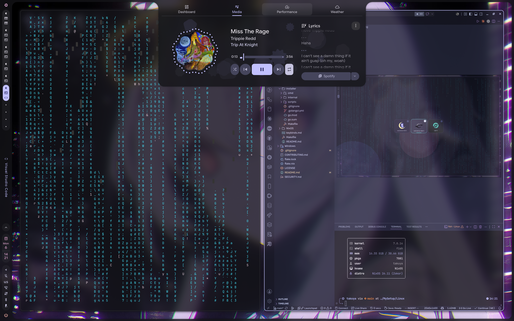
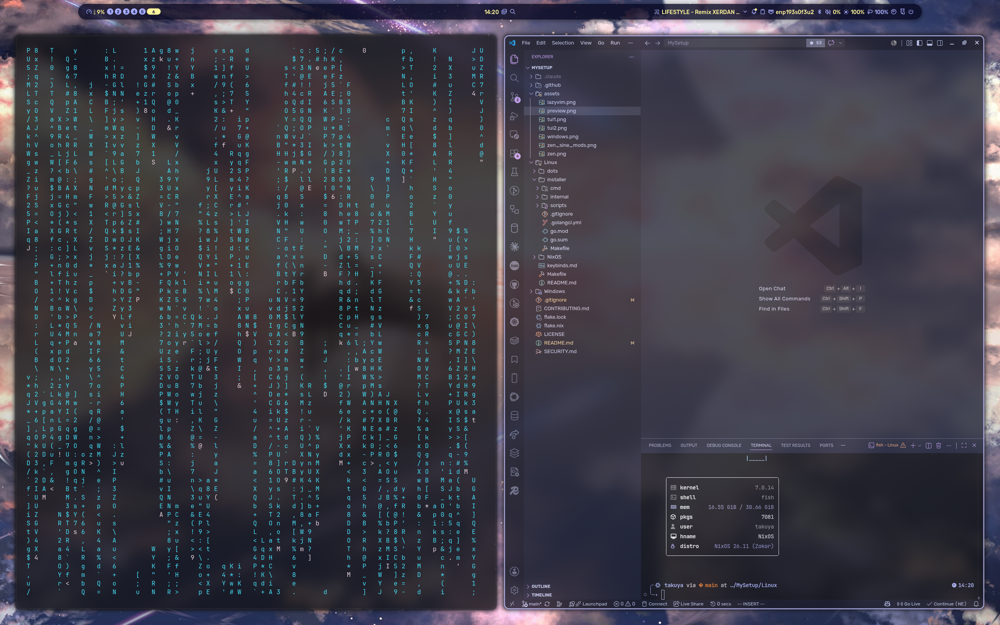
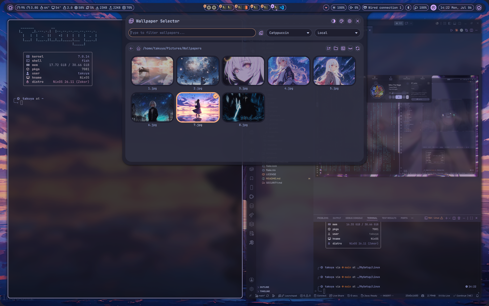
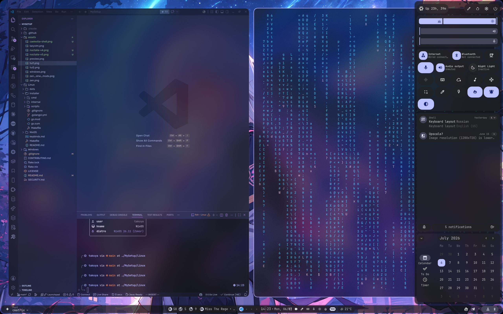

# My Setup

> **! READ THE README FOR YOUR PLATFORM BEFORE DOING ANYTHING !**
>
> - Linux (NixOS): [Linux/README.md](Linux/README.md)
> - Windows: [Windows/README.md](Windows/README.md)

Personal system configuration for Linux (NixOS + Hyprland) and Windows (Komorebi + YASB).

[](https://youtu.be/fgmueUOnfhk)

*[8-minute video tour](https://youtu.be/fgmueUOnfhk) - click the image above*

---

## `SUPER + SHIFT + W` -> switch shell

Three interchangeable Hyprland shells - **caelestia**, **noctalia**, **end-4** - swap between them at
runtime, no reinstall needed. Details: [Linux/README.md](Linux/README.md#runtime-shells).

Full keybind reference (every shell, every bind): [GitHub Wiki](https://github.com/TakuyaYagam1/MySetup/wiki)
or [`Linux/keybinds.md`](Linux/keybinds.md).

---

## Screenshots

| caelestia-shell | noctalia v5 | noctalia v4 | end-4 (Illogical Impulse) |
| :---: | :---: | :---: | :---: |
|  |  |  |  |

| Zen Browser (Catppuccin chrome) | Zen + Sine mods | Neovim (LazyVim) |
| :---: | :---: | :---: |
|  |  |  |

| TUI Installer - User | TUI Installer - Display |
| :---: | :---: |
|  |  |


> Contributors: read [CONTRIBUTING.md](CONTRIBUTING.md) before opening a PR. Security issues: see [SECURITY.md](SECURITY.md).

## Structure

- **Linux/** - NixOS configuration with Hyprland 0.55+ Lua config, custom themes, dev environment
- **Windows/** - Windows configuration with Komorebi tiling WM and YASB status bar

## Quick Start

### Linux (NixOS)

> **Read [Linux/README.md](Linux/README.md) first** - pre-installation requirements, path
> config, regional notes, troubleshooting, and the full command reference all live there.

| Scenario | Command |
| --- | --- |
| Install (stable `main`, opens TUI) | `nix run --refresh 'github:TakuyaYagam1/MySetup'` |
| Install (latest `dev`, opens TUI) | `nix run --refresh 'github:TakuyaYagam1/MySetup/dev?dir=Linux/NixOS#mysetup' -- tui` |
| Install with more build cores (e.g. 4/4 instead of the safe 1/2 default), latest `dev`, opens TUI | `nix run --refresh --option max-jobs 4 --option cores 4 'github:TakuyaYagam1/MySetup/dev?dir=Linux/NixOS#mysetup' -- tui` |
| Reapply saved config, no TUI | `nix run --refresh 'github:TakuyaYagam1/MySetup?dir=Linux/NixOS#mysetup' -- apply` |
| Inspect / repair an installed host | `nix run --refresh 'github:TakuyaYagam1/MySetup?dir=Linux/NixOS#mysetup' -- doctor` |
| Update an already-installed system | `nixos-update` |

The installer asks about: MySetup channel, username/password, package preset, display and
keyboard layout, Secure Boot, GPU type, locale/timezone, Zapret DPI bypass, CTF tools, and user
dotfiles. Full flag reference (`--layout`, `--lock-mode`, low-RAM bootstrap, flake module usage
for external hosts, etc.) is in [Linux/README.md](Linux/README.md).

### Windows

> **Read [Windows/README.md](Windows/README.md) first** - you must update paths in
> `yasb/config.yaml` before running the installer.

```powershell
git clone https://github.com/TakuyaYagam1/MySetup.git
cd MySetup\Windows
.\install.ps1
```

## Credits

The Hyprland shells, rices, and themes here are built directly on top of these upstream
projects - these dots would not exist without them:

- [meowrch/meowrch](https://github.com/meowrch/meowrch) - original rice that inspired the SDDM
  theme, Plymouth/GRUB visuals, and the overall Hyprland aesthetic.
- [noctalia-dev/noctalia](https://github.com/noctalia-dev/noctalia) - QuickShell-based desktop
  shell shipped as one of the runtime profiles.
- [end-4/dots-hyprland](https://github.com/end-4/dots-hyprland) - the Illogical Impulse
  Hyprland/QuickShell dotfiles wired in as the `end4` runtime profile.
- [caelestia-dots/shell](https://github.com/caelestia-dots/shell) - Caelestia QuickShell, the
  default runtime profile.
- [anotherhadi/nixy](https://github.com/anotherhadi/nixy) - reference NixOS workstation config
  used for ideas around Home Manager modules, MIME defaults, and Nix utility wiring.
- [PortSwigger/mcp-server](https://github.com/PortSwigger/mcp-server) - official Burp Suite MCP
  extension. MySetup does not package it; install it from upstream if you need Burp MCP access.
- [LaurieWired/GhidraMCP](https://github.com/LaurieWired/GhidraMCP) - Ghidra MCP bridge. MySetup
  does not package it; install it from upstream if you need Ghidra MCP access.

Additional thanks to [@outfoxxed](https://github.com/outfoxxed) for
[QuickShell](https://github.com/outfoxxed/quickshell), which all three shell profiles depend on,
and to the wider Hyprland community for the help, suggestions, and reference configs.

## License

GPL-3.0
